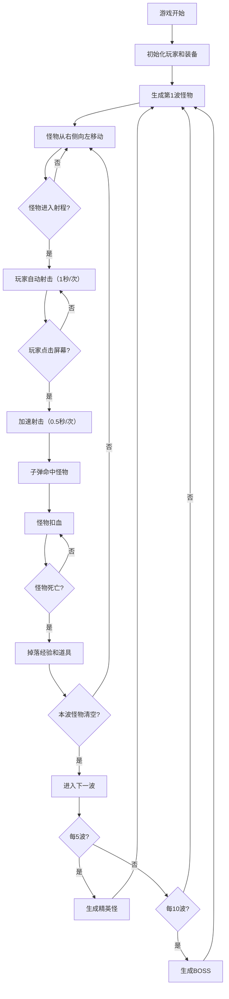
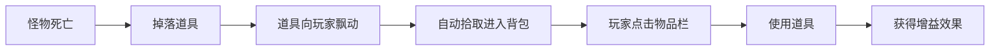

# 横板射击小游戏 产品需求文档（PRD）

## 1. 产品概述

一款2D横板射击休闲网页游戏，玩家控制左侧固定位置的射手，自动或手动射击从右侧涌来的怪物波次，通过击杀怪物获取经验和道具，不断强化角色以应对更强大的敌人。

- **核心玩法**：放置射击 + 点击加速 + 成长收集
- **目标用户**：休闲游戏玩家，喜欢挂机类和射击类游戏的用户
- **产品价值**：低操作门槛、高成就感的碎片化娱乐体验

---

## 2. 核心功能

### 2.1 用户角色

| 角色 | 注册方式 | 核心权限 |
|------|----------|----------|
| 玩家 | 无需注册，浏览器即玩 | 进行游戏、查看装备、使用道具、释放技能 |

### 2.2 功能模块

1. **游戏主界面**：上半屏战斗区域 + 下半屏操作面板
2. **战斗系统**：玩家射击、怪物波次、碰撞检测、伤害计算
3. **波次系统**：普通波次、精英怪、BOSS机制
4. **成长系统**：经验获取、等级提升、属性强化
5. **装备系统**：武器装备栏、属性加成
6. **物品系统**：道具背包、消耗品使用
7. **技能系统**：技能栏、技能释放、冷却机制

### 2.3 页面详情

| 页面名称 | 模块名称 | 功能描述 |
|----------|----------|----------|
| 游戏主界面 | 战斗区域（上半屏） | Canvas渲染游戏画面，玩家角色、子弹、怪物、掉落物、伤害数字 |
| 游戏主界面 | 状态栏 | 当前波次、生命值、经验条、金币/分数显示 |
| 游戏主界面 | 装备栏 | 武器槽位，显示当前装备，可点击更换/查看详情 |
| 游戏主界面 | 物品栏 | 道具格子，显示持有道具，点击使用 |
| 游戏主界面 | 技能栏 | 技能图标，显示冷却状态，点击释放技能 |
| 游戏主界面 | 波次提示 | 新波次开始时的动画提示 |
| 游戏主界面 | BOSS血条 | BOSS出现时显示顶部血条 |

---

## 3. 核心流程

### 3.1 游戏主循环

### 3.2 道具拾取与使用流程

---

## 4. 用户界面设计

### 4.1 设计风格

- **整体风格**：像素风 + 霓虹科技感，复古与现代结合
- **主色调**：深蓝色背景（#0a0e27）+ 青色霓虹（#00f0ff）+ 橙色强调（#ff6b35）
- **辅助色**：紫色（#9d4edd）用于精英怪、红色（#ff0054）用于BOSS
- **字体**：Press Start 2P（像素风标题）+ VT323（游戏内文字）
- **按钮风格**：带霓虹发光边框的像素风按钮，hover时有脉冲动画
- **布局风格**：上半屏游戏画布 + 下半屏深色面板，分区清晰
- **图标风格**：像素风格emoji图标，配合发光效果

### 4.2 页面设计概览

| 页面名称 | 模块名称 | UI元素 |
|----------|----------|--------|
| 游戏主界面 | 战斗区域 | 星空背景、玩家角色（左侧）、怪物（右侧来袭）、子弹轨迹、伤害飘字、经验球 |
| 游戏主界面 | 顶部状态栏 | 波次数字、血条（红色渐变）、经验条（青色渐变）、分数显示 |
| 游戏主界面 | BOSS血条 | 顶部居中大血条，红色渐变，带BOSS名称 |
| 游戏主界面 | 装备栏 | 3个装备槽，武器图标，品质边框，悬浮显示属性 |
| 游戏主界面 | 物品栏 | 6个物品格子，堆叠数量，点击使用，冷却遮罩 |
| 游戏主界面 | 技能栏 | 4个技能图标，冷却倒计时，点击释放，发光描边 |
| 游戏主界面 | 波次提示 | 中央大号文字动画，"第X波" 渐入渐出 |

### 4.3 响应式

- **设计原则**：桌面端优先，自适应屏幕尺寸
- **游戏画布**：保持16:9宽高比，根据窗口宽度自适应缩放
- **操作面板**：下半屏高度固定比例（40%屏幕高度），格子大小自适应
- **移动端适配**：触摸操作优化，按钮区域增大，支持横屏游戏

### 4.4 视觉动效

- **射击效果**：枪口闪光、子弹拖尾、命中火花
- **怪物受击**：闪白反馈、击退效果
- **死亡效果**：爆炸粒子、渐隐消失
- **道具拾取**：磁吸飘动、飞入背包动画
- **技能释放**：全屏特效、屏幕震动
- **UI动效**：按钮脉冲、数值跳动、进度条平滑过渡
