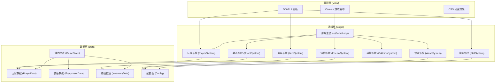

# 横板射击小游戏 技术架构文档

## 1. 架构设计



## 2. 技术选型说明

| 分类 | 技术 | 版本 | 说明 |
|------|------|------|------|
| 前端框架 | React | 18.x | 组件化UI开发，管理底部面板状态 |
| 构建工具 | Vite | 5.x | 快速开发构建，热更新 |
| 语言 | TypeScript | 5.x | 类型安全，更好的代码可维护性 |
| 样式 | Tailwind CSS | 3.x | 快速构建UI，响应式布局 |
| 游戏渲染 | HTML5 Canvas | - | 2D游戏渲染，性能优秀 |
| 状态管理 | React Context + useReducer | - | 游戏状态管理 |
| 动画 | CSS + Canvas原生 | - | UI动画用CSS，游戏特效用Canvas |

**选择理由**：
- React 负责底部操作面板的复杂UI交互和状态管理
- Canvas 负责游戏战斗区域的高性能渲染
- TypeScript 确保游戏逻辑的类型安全
- Tailwind CSS 快速构建响应式UI面板

## 3. 目录结构

```
src/
├── game/                    # 游戏核心逻辑（纯JS/TS，不依赖React）
│   ├── GameEngine.ts        # 游戏引擎主类
│   ├── systems/             # 游戏系统
│   │   ├── PlayerSystem.ts  # 玩家系统
│   │   ├── ShootSystem.ts   # 射击系统
│   │   ├── EnemySystem.ts   # 怪物系统
│   │   ├── WaveSystem.ts    # 波次系统
│   │   ├── CollisionSystem.ts # 碰撞系统
│   │   ├── ItemSystem.ts    # 道具系统
│   │   └── SkillSystem.ts   # 技能系统
│   ├── entities/            # 游戏实体
│   │   ├── Player.ts        # 玩家实体
│   │   ├── Bullet.ts        # 子弹实体
│   │   ├── Enemy.ts         # 怪物实体
│   │   ├── Item.ts          # 掉落物实体
│   │   └── Particle.ts      # 粒子特效
│   ├── data/                # 数据配置
│   │   ├── enemies.ts       # 怪物配置表
│   │   ├── weapons.ts       # 武器配置表
│   │   ├── items.ts         # 道具配置表
│   │   └── skills.ts        # 技能配置表
│   └── types/               # 类型定义
│       └── game.ts          # 游戏相关类型
├── components/              # React UI组件
│   ├── GameCanvas.tsx       # 游戏画布组件
│   ├── StatusBar.tsx        # 顶部状态栏
│   ├── EquipmentBar.tsx     # 装备栏
│   ├── InventoryBar.tsx     # 物品栏
│   ├── SkillBar.tsx         # 技能栏
│   ├── WaveNotice.tsx       # 波次提示
│   └── BossHealthBar.tsx    # BOSS血条
├── hooks/                   # React Hooks
│   └── useGameEngine.ts     # 游戏引擎Hook
├── store/                   # 状态管理
│   ├── GameContext.tsx      # 游戏上下文
│   └── gameReducer.ts       # 游戏状态reducer
├── App.tsx                  # 主应用组件
├── main.tsx                 # 入口文件
└── index.css                # 全局样式
```

## 4. 核心模块设计

### 4.1 游戏引擎 (GameEngine)

```typescript
interface GameEngine {
  canvas: HTMLCanvasElement;
  ctx: CanvasRenderingContext2D;
  
  start(): void;
  stop(): void;
  pause(): void;
  resume(): void;
  
  // 系统引用
  playerSystem: PlayerSystem;
  shootSystem: ShootSystem;
  enemySystem: EnemySystem;
  waveSystem: WaveSystem;
  collisionSystem: CollisionSystem;
  itemSystem: ItemSystem;
  skillSystem: SkillSystem;
  
  // 事件回调
  onStateChange?: (state: GameState) => void;
  onWaveChange?: (wave: number) => void;
  onBossSpawn?: (boss: Enemy) => void;
  onBossDefeat?: () => void;
}
```

### 4.2 玩家数据结构

```typescript
interface PlayerData {
  x: number;
  y: number;
  width: number;
  height: number;
  health: number;
  maxHealth: number;
  level: number;
  exp: number;
  expToNextLevel: number;
  attack: number;
  attackSpeed: number;      // 攻击间隔(ms)，默认1000
  manualAttackSpeed: number; // 手动点击攻击间隔(ms)，默认500
  range: number;            // 射程
  isManualShooting: boolean; // 是否处于手动射击状态
  equipment: Equipment[];   // 装备列表
  inventory: ItemStack[];   // 物品栏
  skills: Skill[];          // 技能列表
}
```

### 4.3 怪物数据结构

```typescript
interface EnemyData {
  id: string;
  type: 'normal' | 'elite' | 'boss';
  name: string;
  x: number;
  y: number;
  width: number;
  height: number;
  health: number;
  maxHealth: number;
  speed: number;
  damage: number;
  exp: number;
  dropRate: number;
  color: string;
}
```

### 4.4 波次配置

```typescript
interface WaveConfig {
  wave: number;
  enemyCount: number;       // 20-50只
  enemyTypes: string[];
  spawnInterval: number;    // 生成间隔
  hasElite: boolean;        // 每5波有精英
  hasBoss: boolean;         // 每10波有BOSS
  healthMultiplier: number; // 血量倍率
  speedMultiplier: number;  // 速度倍率
}
```

## 5. 核心算法

### 5.1 碰撞检测 (AABB)

```
function checkCollision(a, b):
  return a.x < b.x + b.width &&
         a.x + a.width > b.x &&
         a.y < b.y + b.height &&
         a.y + a.height > b.y
```

### 5.2 射击逻辑

- 自动射击：每 `attackSpeed` 毫秒检测一次射程内是否有敌人，有则发射
- 手动射击：点击屏幕触发，冷却 `manualAttackSpeed` 毫秒
- 子弹飞行：从玩家位置向右匀速移动，超出画布或命中敌人销毁

### 5.3 寻敌逻辑

- 从右向左移动的怪物，进入玩家射程范围即被锁定
- 优先攻击最靠近玩家的怪物
- 子弹沿水平方向飞行，命中路径上的第一个敌人

### 5.4 经验与升级

- 击杀怪物获得经验值
- 经验达到阈值自动升级
- 升级提升攻击力、生命值等属性

## 6. 性能优化策略

| 优化点 | 策略 |
|--------|------|
| 对象池 | 子弹、怪物、粒子效果使用对象池复用，避免频繁GC |
| 离屏检测 | 超出画布的实体暂停更新或回收 |
| 批量渲染 | 同类型实体批量绘制，减少Canvas状态切换 |
| 帧率控制 | 游戏逻辑固定60fps，渲染使用requestAnimationFrame |
| 碰撞优化 | 使用空间分区，减少碰撞检测对数 |
| 粒子上限 | 粒子效果设置最大数量，超出后不生成新粒子 |

## 7. 响应式适配

- 游戏画布：根据容器宽度自适应，保持16:9比例
- 底部面板：高度固定为视口的40%，内部使用flex布局自适应
- 格子大小：使用CSS clamp()函数，确保在不同屏幕尺寸下合理显示
- 触摸支持：移动端触摸事件映射为点击事件
